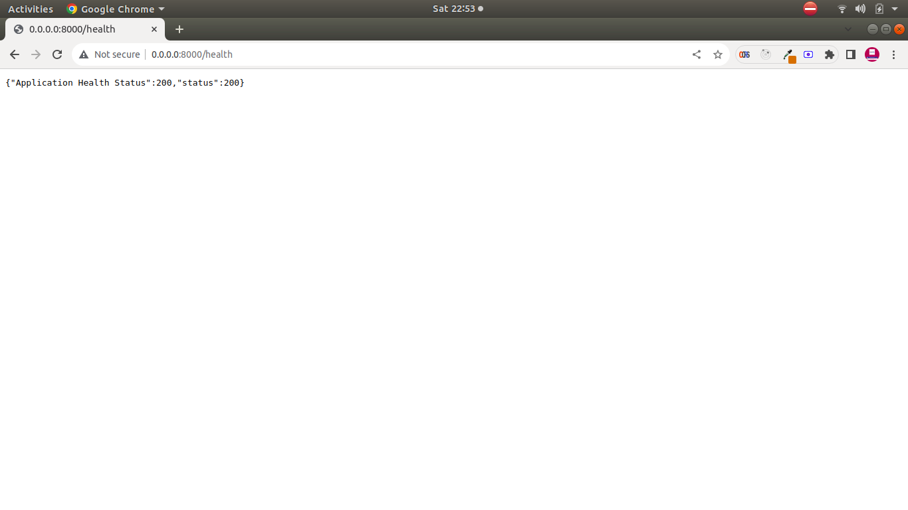

# fastapi-docker

Added by Ashish Kumar Saxena

# Folder Structure

```
.
├── app
│   ├── database
│   │   ├── models
│   │   │   └── users.py
│   │   ├── schemas
│   │   └── settings.py
│   ├── dependencies.py
│   ├── __init.py__
│   ├── internal
│   │   ├── admin.py
│   │   └── __init__.py
│   ├── main.py
│   ├── routers
│   │   ├── __init__.py
│   │   └── users.py
│   └── tests
│       ├── test_main.py
│       └── test_users.py
├── compose.yaml
├── Dockerfile
├── https:
│   └── github.com
│       └── saxenaashish05
│           └── fastapi-docker.git
└── requirements.txt

```
# Deploy with Docker compose

```
run at the root level below command

docker compose up -d --build

docker compose up -d
[+] Running 1/0
 ✔ Container fastapi-application  Running 
```
# Expected result on terminal
```
CONTAINER ID   IMAGE           COMMAND       CREATED       STATUS       PORTS                                               NAMES
2b9c50510e9f   clarivate-api   "/start.sh"   2 hours ago   Up 2 hours   80/tcp, 0.0.0.0:8000->8000/tcp, :::8000->8000/tcp   fastapi-application


```


